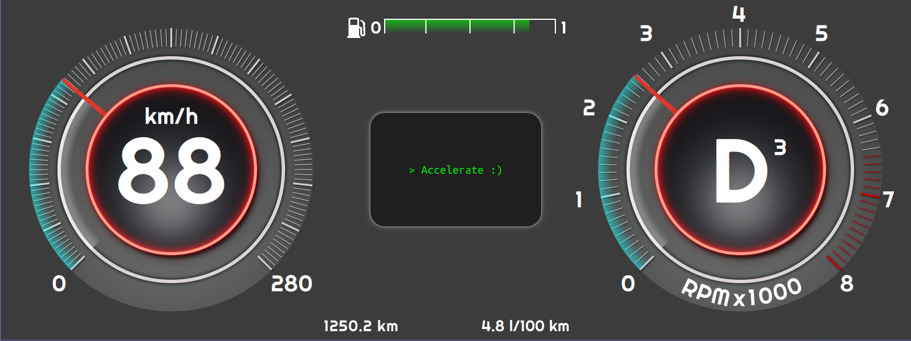

# CppQt Digital Cockpit Simulator

A very simple simulator for a digital car-cockpit.
This project was created over the course of one weekend after playing around with Qt for two to three weeks.

The graphical user interface was created with qml and the backend takes place in pure C++.

## Prerequisites

In order to compile and run this project you will need a necessary Qt-Component:
- 'Qt 5 Compatibility Module' (7.97 MB)

This project also includes custom fonts that need to be manually installed beforehand.
(Note: Qt will use the default font if the custom font is not installed on your device.)

## Keybindings

Keybindings for the digital car-cockpit simulator.

|Key|Action|
|---|---|
|**S**|Start/Stop Engine|
|**Spacebar**|Accelerate|
|**D**|Switch to Drive Mode|
|**N**|Switch to Idel Mode|
|**R**|Toggle Reverse Camera|
|**P**|Switch to Parking Mode|
|**T**|Drive at current velocity|
|**F**|Fill Tank|
|**ArrowDown**| Brake|

